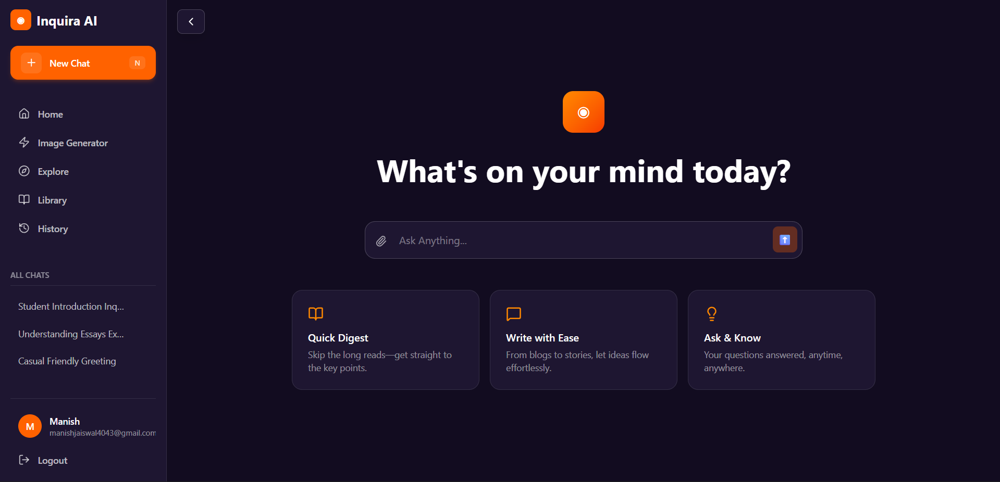

# 🚀 Inquira AI

**Inquira AI** is a sophisticated, full-stack AI-powered chat application inspired by ChatGPT. It delivers an exceptional conversational experience with real-time messaging, intelligent multi-model AI responses, internet search capabilities, and a polished, responsive user interface. Built with modern web technologies and powered by Google Gemini and Mistral AI via LangChain.

## 📸 Application Preview



---

## 🎯 Project Overview

Inquira AI is an enterprise-grade chat platform that seamlessly combines modern AI capabilities with excellent user experience. The application leverages cutting-edge technologies to deliver:

- **Intelligent AI Conversations** powered by LangChain with multiple model support
- **Real-time Messaging** using WebSocket technology (Socket.io)
- **Adaptive AI Agents** that intelligently use tools like internet search
- **Secure User Authentication** with email verification and JWT tokens
- **Persistent Chat History** with automatic conversation titles
- **Modern, Responsive UI** that works on all devices

---

## 🌟 Core Features

### Chat & Messaging
- 💬 **Real-time AI Chat Interface** - Instant message delivery via WebSockets
- ⚡ **Streaming Responses** - Typing effect for natural conversation flow
- 🤖 **"Thinking…" State** - Visual feedback while AI processes your message
- 🔄 **Auto Scroll** - Automatic scrolling to latest messages (like ChatGPT)
- 📜 **Chat History** - View and manage all past conversations
- 💾 **Message Persistence** - All messages permanently saved to MongoDB
- 🏷️ **Auto-Generated Titles** - AI creates descriptive names for conversations

### AI Intelligence
- 🧠 **Multi-Model LLM Support** 
  - Google Gemini Flash for fast, accurate responses
  - Mistral AI Medium for high-quality, nuanced outputs
- 🌐 **Internet Search Integration** - Real-time web search via Tavily API
- 🔍 **Intelligent Agent System** - LangChain agents automatically decide when to search
- 🎯 **Context-Aware Responses** - AI understands full conversation context
- 🛠️ **Tool Usage** - Agents use tools dynamically for better answers

### Security & Authentication
- 🔐 **Secure Authentication** - JWT-based auth with HTTP-only cookies
- ✉️ **Email Verification** - 24-hour verification tokens for new accounts
- 🔒 **Password Security** - bcryptjs with 10-salt rounds for encryption
- 🚫 **Protected Routes** - Private routes and API endpoints with middleware
- 👤 **User Sessions** - Secure session management

### User Experience
- 🎨 **Modern UI Design** - Beautiful gradients, smooth animations, glassmorphism effects
- 📱 **Fully Responsive** - Perfect experience on desktop, tablet, and mobile
- ⌨️ **Keyboard Shortcuts** - Efficient navigation and controls
- 🌙 **Code Syntax Highlighting** - Beautiful code blocks with highlights
- 📝 **Markdown Support** - Full GFM (GitHub Flavored Markdown) rendering
- 💾 **Chat Persistence** - All messages saved automatically
- 🎯 **Intuitive Interface** - Clean, modern design inspired by ChatGPT

---

## 🛠️ Tech Stack

### Frontend Stack
| Technology | Version | Purpose |
|-----------|---------|---------|
| **React.js** | 19.1.1 | UI component framework |
| **Redux Toolkit** | 2.11.2 | State management |
| **Tailwind CSS** | 4.2.1 | Utility-first styling |
| **Vite** | 7.1.7 | Fast build tool & dev server |
| **Axios** | 1.13.6 | HTTP client |
| **Socket.io Client** | 4.8.3 | Real-time communication |
| **React Router** | 7.13.1 | Client-side routing |
| **React Markdown** | 10.1.0 | Markdown rendering |
| **Highlight.js** | 11.9.0 | Code syntax highlighting |
| **Remark GFM** | 4.0.1 | GitHub Flavored Markdown parser |
| **Lucide React** | 0.577.0 | Icon library |

### Backend Stack
| Technology | Version | Purpose |
|-----------|---------|---------|
| **Node.js** | 16+ | JavaScript runtime |
| **Express.js** | 5.2.1 | Web application framework |
| **MongoDB** | 9.3.0 | NoSQL database |
| **Mongoose** | 9.3.0 | MongoDB ODM |
| **Socket.io** | 4.8.3 | Real-time bidirectional communication |
| **LangChain** | 1.2.32 | AI orchestration & tool management |
| **@langchain/google-genai** | 2.1.25 | Google Gemini integration |
| **@langchain/mistralai** | 1.0.7 | Mistral AI integration |
| **@tavily/core** | 0.7.2 | Web search API |
| **jsonwebtoken** | 9.0.3 | JWT authentication |
| **bcryptjs** | 3.0.3 | Password hashing |
| **Nodemailer** | 8.0.2 | Email service |
| **Express Validator** | 7.3.1 | Input validation |
| **Zod** | 4.3.6 | Schema validation |
| **CORS** | 2.8.6 | Cross-origin resource sharing |
| **Morgan** | 1.10.1 | HTTP request logging |
| **Multer** | 2.1.1 | File upload handling |
| **googleapis** | 171.4.0 | Google APIs |

---

## 🏗️ Architecture

### Frontend Architecture (4-Layer Pattern)

```
src/
├── features/              # Feature-based modular structure
│   ├── auth/             # Authentication module
│   │   ├── auth.slice.js         # Redux state for auth
│   │   ├── components/
│   │   │   └── Protected.jsx     # Route protection wrapper
│   │   ├── hook/
│   │   │   └── useAuth.js        # Auth business logic hook
│   │   ├── pages/
│   │   │   ├── Login.jsx         # Login page component
│   │   │   └── Register.jsx      # Registration page component
│   │   └── service/
│   │       └── auth.api.js       # API integration for auth
│   └── chat/             # Chat feature module
│       ├── chat.slice.js         # Redux state for chats
│       ├── hooks/
│       │   └── useChat.js        # Chat logic & WebSocket management
│       ├── pages/
│       │   └── Dashboard.jsx     # Main chat interface
│       └── service/
│           ├── chat.api.js       # REST API calls
│           └── chat.socket.js    # WebSocket event handlers
├── app/
│   ├── App.jsx           # Root component, auth initialization
│   ├── app.routes.jsx    # Route definitions
│   ├── app.store.js      # Redux store instance
│   └── index.css         # Global styles
└── main.jsx              # Application entry point
```

**Layer Architecture:**
1. **Component Layer** - Reusable React components for UI rendering
2. **Hook Layer** - Custom hooks (useAuth, useChat) containing business logic
3. **Service Layer** - Handles API calls and WebSocket management
4. **API Layer** - Direct backend communication with Axios

### Backend Architecture (MVC Pattern)

```
Backend/
├── server.js             # Entry point, HTTP & Socket.io server
├── src/
│   ├── app.js            # Express middleware & route configuration
│   ├── config/
│   │   └── database.js   # MongoDB connection & initialization
│   ├── controllers/
│   │   ├── auth.controller.js    # Register, login, verify email
│   │   └── chat.controller.js    # Chat CRUD operations
│   ├── middlewares/
│   │   └── auth.middleware.js    # JWT verification
│   ├── models/
│   │   ├── user.model.js         # User schema with bcrypt hashing
│   │   ├── chat.model.js         # Chat document structure
│   │   └── message.model.js      # Message schema
│   ├── routes/
│   │   ├── auth.routes.js        # Auth API endpoints
│   │   └── chat.routes.js        # Chat API endpoints
│   ├── services/
│   │   ├── ai.service.js         # LangChain agent, model orchestration
│   │   ├── internet.service.js   # Tavily API web search
│   │   └── mail.service.js       # Email verification
│   ├── validators/
│   │   └── auth.validator.js     # Input validation (Zod/Express Validator)
│   └── sockets/
│       └── server.socket.js      # WebSocket event handlers
└── .env                  # Environment variables
```

**Component Responsibilities:**
- **Controllers** - Request handling and response
- **Models** - Data schema and validation
- **Services** - Business logic and external API integration
- **Routes** - Endpoint definitions
- **Middlewares** - Authentication and request validation
- **Sockets** - Real-time communication

---

## 💾 Database Schema

### User Collection
```javascript
{
  _id: ObjectId,
  username: String (unique, required, trimmed),
  email: String (unique, required, lowercase, trimmed),
  password: String (bcrypt hashed, min 6 chars),
  verified: Boolean (default: false),
  createdAt: Date,
  updatedAt: Date
}
```

### Chat Collection
```javascript
{
  _id: ObjectId,
  user: ObjectId (ref: User),
  title: String (default: "New Chat", auto-generated by AI),
  createdAt: Date,
  updatedAt: Date
}
```

### Message Collection
```javascript
{
  _id: ObjectId,
  chat: ObjectId (ref: Chat),
  content: String (required, message text),
  role: String (enum: ['user', 'ai']),
  createdAt: Date,
  updatedAt: Date
}
```

---

## 🤖 AI & Intelligence System

### LangChain Architecture

Inquira AI uses **LangChain** to orchestrate multiple AI models and tools:

```
User Message
    ↓
LangChain Agent (Mistral AI)
    ↓
Agent Analysis
    ├─→ Can answer directly? → Generate Response
    └─→ Needs current info? → Use searchInternet Tool
            ↓
        Tavily API Search (10 results)
            ↓
        Process Search Results
            ↓
        Generate AI Response
            ↓
        Stream Response to Client
```

### Supported Models

| Model | Provider | Purpose | Status |
|-------|----------|---------|--------|
| **Gemini Flash** | Google | Fast, accurate responses; general queries | Available |
| **Mistral Medium** | Mistral AI | Reasoning, complex tasks; agent control | Active |
| **Internet Search** | Tavily | Real-time web search | Integrated |

### Agent Tools

- **searchInternet** - Web search using Tavily API
  - Returns 10 most relevant results
  - Provides source URLs and summaries
  - Used automatically when needed

### System Prompt

The AI system operates under these principles:
```
- Helpful and precise assistant
- Acknowledges knowledge limitations
- Uses internet search for current information
- Provides accurate, sourced answers
- Maintains conversation context
```

---

## 🔐 Authentication & Security

### Registration Flow

```
1. User submits registration form
   ├─ Email & password validation
   ├─ Check for duplicate email/username
   ├─ Hash password with bcrypt (10 rounds)
   └─ Create user with verified: false

2. Generate JWT verification token
   ├─ Payload: { email, exp: 24h }
   ├─ Sign with JWT_SECRET
   └─ Create verification link

3. Send verification email
   ├─ HTML formatted email
   ├─ Includes verification link
   ├─ Expires in 24 hours
   └─ Send via Nodemailer

4. Return success response
   └─ Prompt user to check email
```

### Login Flow

```
1. User submits email & password
   ├─ Find user by email
   └─ Compare password with bcrypt

2. Password validation
   ├─ Use bcryptjs.compare()
   ├─ If invalid: return error
   └─ If valid: continue

3. Generate JWT token
   ├─ Payload: { userId }
   ├─ Expires: 7 days
   └─ Sign with JWT_SECRET

4. Send secure response
   ├─ Set HTTP-only cookie
   ├─ Return user data
   └─ Redirect to dashboard
```

### Protected Routes

```
Client Request
    ↓
Extract JWT from Cookie
    ↓
Verify Signature
    ├─ Invalid? → Return 401 Unauthorized
    └─ Valid? → Extract user ID

Attach User to Request
    ↓
Proceed to Route Handler
```

### Security Features

- 🔒 **Password Hashing** - bcryptjs with 10-salt rounds
- 🔐 **JWT Tokens** - Secure signature verification
- 🍪 **HTTP-only Cookies** - Prevents XSS attacks
- ✉️ **Email Verification** - Confirms ownership
- 🚫 **CORS Protection** - Controlled cross-origin access
- 🔍 **Input Validation** - Zod & Express Validator
- 🛡️ **Middleware Protection** - Auth middleware on protected routes

---

## 📊 Data Flow

### Message Flow

```
User Types Message
    ↓
Send via Socket.io
    ↓
Backend receives message
    ├─ Validate user authentication
    ├─ Save message to database
    └─ Send to AI service

LangChain Agent processes
    ├─ Check if needs internet search
    ├─ Call Tavily if needed
    └─ Generate response

Stream response via Socket.io
    ↓
Frontend receives chunks
    ├─ Display typing effect
    ├─ Append text progressively
    └─ Save to database

Store in message history
    ↓
Display in chat UI
```

### Chat Creation

```
User starts new chat
    ↓
Create Chat in MongoDB
    ├─ Associate with user ID
    └─ Initialize with default title

Send first message
    ↓
Generate AI response
    ↓
Use response to generate title
    ├─ Send first message to Mistral
    └─ Get 2-4 word description

Update chat with AI-generated title
    ↓
Persist to database
```

---

## 📋 Project File Structure

```
Inquira-AI/
├── Backend/
│   ├── node_modules/
│   ├── src/
│   │   ├── app.js                    # Express app setup
│   │   ├── config/
│   │   │   └── database.js          # MongoDB connection
│   │   ├── controllers/
│   │   │   ├── auth.controller.js   # Auth logic (60+ lines)
│   │   │   └── chat.controller.js   # Chat operations
│   │   ├── middlewares/
│   │   │   └── auth.middleware.js   # JWT verification
│   │   ├── models/
│   │   │   ├── user.model.js        # User schema + password hashing
│   │   │   ├── chat.model.js        # Chat document
│   │   │   └── message.model.js     # Message document
│   │   ├── routes/
│   │   │   ├── auth.routes.js       # POST /register, /login, etc.
│   │   │   └── chat.routes.js       # GET /chats, POST /chats, etc.
│   │   ├── services/
│   │   │   ├── ai.service.js        # LangChain agent (70+ lines)
│   │   │   ├── internet.service.js  # Tavily web search
│   │   │   └── mail.service.js      # Email verification
│   │   ├── validators/
│   │   │   └── auth.validator.js    # Input validation rules
│   │   └── sockets/
│   │       └── server.socket.js     # Socket.io events
│   ├── package.json
│   ├── package-lock.json
│   ├── server.js                    # Entry point (HTTP + Socket.io)
│   └── .env ([not in repo])
│
├── Frontend/
│   ├── node_modules/
│   ├── public/
│   │   └── [static assets]
│   ├── src/
│   │   ├── main.jsx                 # React DOM render
│   │   ├── app/
│   │   │   ├── App.jsx              # Root component
│   │   │   ├── app.routes.jsx       # Route definitions
│   │   │   ├── app.store.js         # Redux store
│   │   │   └── index.css            # Global styles
│   │   ├── features/
│   │   │   ├── auth/
│   │   │   │   ├── auth.slice.js    # Redux auth state
│   │   │   │   ├── components/
│   │   │   │   │   └── Protected.jsx
│   │   │   │   ├── hook/
│   │   │   │   │   └── useAuth.js
│   │   │   │   ├── pages/
│   │   │   │   │   ├── Login.jsx
│   │   │   │   │   └── Register.jsx
│   │   │   │   └── service/
│   │   │   │       └── auth.api.js
│   │   │   └── chat/
│   │   │       ├── chat.slice.js    # Redux chat state
│   │   │       ├── hooks/
│   │   │       │   └── useChat.js
│   │   │       ├── pages/
│   │   │       │   └── Dashboard.jsx
│   │   │       └── service/
│   │   │           ├── chat.api.js
│   │   │           └── chat.socket.js
│   │   └── [components & utilities]
│   ├── index.html
│   ├── package.json
│   ├── vite.config.js
│   ├── eslint.config.js
│   ├── .env.local ([not in repo])
│   └── tailwind.config.js
│
├── assets/
│   └── UI.png
├── .gitignore
└── README.md
```

---

## 🚀 Getting Started

### Prerequisites

Ensure you have the following installed:
- **Node.js** (v16.0.0 or higher)
- **npm** or **yarn** package manager
- **MongoDB** (local installation or MongoDB Atlas cloud account)
- **API Keys** (required):
  - [Google Gemini API](https://aistudio.google.com/app/apikey)
  - [Mistral AI API](https://console.mistral.ai)
  - [Tavily Search API](https://tavily.com)

### Backend Setup

1. **Navigate to Backend Directory**
   ```bash
   cd Backend
   ```

2. **Install Dependencies**
   ```bash
   npm install
   ```

3. **Create .env File**
   ```bash
   # Server Configuration
   PORT=8000
   
   # Database
   MONGODB_URI=your_mongoDb_uri_here
   
   # AI Model APIs
   GEMINI_API_KEY=your_google_gemini_api_key_here
   MISTRAL_API_KEY=your_mistral_api_key_here
   
   # Search API
   TAVILY_API_KEY=your_tavily_api_key_here
   
   # Authentication
   JWT_SECRET=your_super_secret_jwt_key_12345
   
   # Email Configuration (Gmail App Password)
   EMAIL_USER=your-email@gmail.com
   EMAIL_PASSWORD=your-gmail-app-password
   
   # Frontend Configuration
   FRONTEND_URL=http://localhost:5173
   ```

   **Note:** 
   - For Gmail, use [App Passwords](https://myaccount.google.com/apppasswords) instead of regular password
   - Generate JWT_SECRET using: `node -e "console.log(require('crypto').randomBytes(32).toString('hex'))"`

4. **Start Development Server**
   ```bash
   npm run dev
   ```
   Backend server will start on **http://localhost:8000**

### Frontend Setup

1. **Navigate to Frontend Directory**
   ```bash
   cd Frontend
   ```

2. **Install Dependencies**
   ```bash
   npm install
   ```

3. **Create .env.local File**
   ```
   VITE_API_URL=http://localhost:8000
   ```

4. **Start Development Server**
   ```bash
   npm run dev
   ```
   Frontend will start on **http://localhost:5173**

5. **Build for Production**
   ```bash
   npm run build          # Creates optimized build
   npm run preview        # Preview production build locally
   ```

### Running Both Simultaneously

**Terminal 1 - Backend:**
```bash
cd Backend
npm run dev
```

**Terminal 2 - Frontend:**
```bash
cd Frontend
npm run dev
```

Then open **http://localhost:5173** in your browser.

---

## 🔌 API Endpoints

### Authentication Endpoints

| Method | Endpoint | Body | Description |
|--------|----------|------|-------------|
| POST | `/api/auth/register` | `{username, email, password}` | Create new user account |
| POST | `/api/auth/login` | `{email, password}` | Login and receive JWT |
| GET | `/api/auth/verify-email?token=X` | - | Verify email with token |
| GET | `/api/auth/me` | - | Get current user profile |
| POST | `/api/auth/logout` | - | Logout user (clear session) |

### Chat Endpoints

| Method | Endpoint | Body | Description |
|--------|----------|------|-------------|
| GET | `/api/chats` | - | Get all user's chats |
| POST | `/api/chats` | `{title?}` | Create new chat |
| GET | `/api/chats/:chatId` | - | Get messages from chat |
| DELETE | `/api/chats/:chatId` | - | Delete chat and messages |
| POST | `/api/chats/:chatId/messages` | `{content}` | Send message to chat |

### WebSocket Events

**Client → Server Events**
```javascript
socket.emit('send_message', {
  chatId: string,
  message: string
})

socket.on('disconnect')
```

**Server → Client Events**
```javascript
socket.on('message_response', {
  chatId: string,
  message: { _id, content, role, createdAt }
})

socket.on('chat_created', {
  chat: { _id, title, createdAt }
})

socket.on('error', {
  message: string
})
```

---

## 🔧 Available Scripts

### Backend Scripts
```bash
npm run dev      # Start development server with hot reload (nodemon)
npm test         # Run test suite (if configured)
```

### Frontend Scripts
```bash
npm run dev      # Start Vite dev server (localhost:5173)
npm run build    # Build for production
npm run preview  # Preview production build locally
npm run lint     # Run ESLint to check code quality
```

---

## 📦 Key Implementation Details

### Real-time Chat with Socket.io

```javascript
// Client sends message
socket.emit('send_message', { chatId, message });

// Server processes and streams response
socket.on('message_response', (data) => {
  // Update UI with streaming response
});
```

### AI Response Generation

The application uses a sophisticated agent system:

```javascript
// LangChain Agent Flow
1. Receive user message + history
2. Send to Mistral AI agent
3. Agent decides: Direct answer or search internet?
4. If search needed: Call Tavily API
5. Generate response based on search results
6. Stream response character-by-character
7. Save to MongoDB
8. Emit via Socket.io
```

### Redux State Management

```javascript
// Auth Slice
{
  user: { id, username, email, verified },
  isAuthenticated: boolean,
  loading: boolean,
  error: string | null
}

// Chat Slice
{
  chats: [{ _id, title, messages }],
  currentChat: { _id, title, messages },
  loading: boolean,
  error: string | null
}
```

### Email Verification

```javascript
// 1. Generate JWT token with email
const token = jwt.sign({ email }, JWT_SECRET, { expiresIn: '24h' });

// 2. Send HTML email with verification link
const link = `${FRONTEND_URL}/api/auth/verify-email?token=${token}`;

// 3. User clicks link, backend verifies token
const decoded = jwt.verify(token, JWT_SECRET);

// 4. Update user.verified = true in MongoDB
```

---

## 🐛 Troubleshooting

### Common Issues

#### MongoDB Connection Error
```
Error: MongoDB connection failed
```
**Solution:**
- Verify MongoDB is running (local) or cluster is accessible (Atlas)
- Check connection string in `.env`
- Ensure IP whitelist includes your IP (for Atlas)

#### AI API Errors
```
Error: Invalid API key / Rate limit exceeded
```
**Solution:**
- Verify API keys in `.env`
- Check API quota at respective dashboards
- Ensure APIs are enabled in project settings

#### WebSocket Connection Failed
```
Error: Failed to connect to server
```
**Solution:**
- Check CORS origin in `backend/src/app.js`
- Verify frontend and backend URLs match
- Check firewall/network settings
- Verify Socket.io is running on backend

#### Email Not Received
```
Verification email not arriving
```
**Solution:**
- Check spam/junk folder
- Verify EMAIL_USER and EMAIL_PASSWORD in `.env`
- For Gmail: Use [App Password](https://myaccount.google.com/apppasswords)
- Check email service logs

#### Port Already in Use
```
Error: listen EADDRINUSE: address already in use :::8000
```
**Solution:**
```bash
# Windows
netstat -ano | findstr :8000
taskkill /PID <PID> /F

# Mac/Linux
lsof -i :8000
kill -9 <PID>
```

---

## 🌟 Future Enhancements

- [ ] 🔴 Stop Generation Button - Cancel AI response mid-stream
- [ ] 🔄 Regenerate Response - Retry last message
- [ ] 🎤 Voice Input - Speech-to-text messaging
- [ ] 🎧 Voice Output - Text-to-speech responses
- [ ] 📊 Analytics Dashboard - User stats and usage metrics
- [ ] 🌙 Dark/Light Mode - Theme toggle
- [ ] 🔍 Full-text Search - Search through chat history
- [ ] 📎 File Attachments - Upload and analyze files
- [ ] 🌍 Multi-language Support - i18n implementation
- [ ] 📱 Mobile App - React Native version
- [ ] 🔌 Plugin System - Third-party integrations
- [ ] 💰 Subscription Plans - Freemium model

---

## 📝 Development Notes

### Code Quality
- ESLint configured for code style consistency
- Modular component structure for maintainability
- Comprehensive error handling at all layers
- Input validation on frontend and backend

### Performance Optimizations
- Vite for fast development and optimized builds
- Redux Toolkit for efficient state updates
- Socket.io for real-time communication
- Lazy loading for routes and components

### Best Practices Implemented
- Environment variables for sensitive data
- Error boundaries on frontend
- Try-catch blocks on backend
- Validation at multiple layers
- Secure JWT authentication
- CORS protection
- Input sanitization

---

## 📚 Learning Resources

### Technologies Used
- [React.js Documentation](https://react.dev)
- [Redux Toolkit Docs](https://redux-toolkit.js.org)
- [Express.js Guide](https://expressjs.com)
- [MongoDB Documentation](https://docs.mongodb.com)
- [Socket.io Documentation](https://socket.io)
- [LangChain Documentation](https://python.langchain.com)
- [Tailwind CSS](https://tailwindcss.com)

### API Documentation
- [Google Gemini API](https://ai.google.dev)
- [Mistral AI API](https://docs.mistral.ai)
- [Tavily Search API](https://tavily.com/docs)

---

## 🤝 Contributing

Contributions are welcome! To contribute:

1. Fork the repository
2. Create a feature branch (`git checkout -b feature/amazing-feature`)
3. Commit your changes (`git commit -m 'Add amazing feature'`)
4. Push to the branch (`git push origin feature/amazing-feature`)
5. Open a Pull Request

---

## 📄 License

This project is licensed under the **ISC License** - see the LICENSE file for details.

---

## 🙋 Support & Issues

For issues, questions, or suggestions:

1. **Check Logs:**
   - Frontend: Browser DevTools Console (F12)
   - Backend: Terminal output
   - Database: MongoDB Atlas dashboard

2. **Common Checks:**
   - API keys are valid and not expired
   - MongoDB connection string is correct
   - Both backends and frontend are running
   - Firewall isn't blocking ports
   - Environment variables are properly set

3. **Get Help:**
   - Check error messages carefully
   - Review console logs for stack traces
   - Verify all prerequisites are installed

---

## 🏆 Project Highlights

### Architecture Excellence
- Clean separation of concerns
- Scalable 4-layer frontend architecture
- RESTful API design
- Real-time WebSocket integration

### User Experience
- Modern, intuitive interface
- Responsive design
- Smooth animations
- Helpful feedback states

### Security
- JWT authentication
- Password hashing with bcryptjs
- Email verification
- Input sanitization
- CORS protection

### Code Quality
- Modular component structure
- Custom hooks for logic
- Redux for state management
- Error handling throughout

---

**Built with ❤️ by [Manish kumar jaiswal]**

**Made with:** React • Node.js • Express • MongoDB • LangChain • Gemini API • Mistral AI • Tavily • Socket.io
